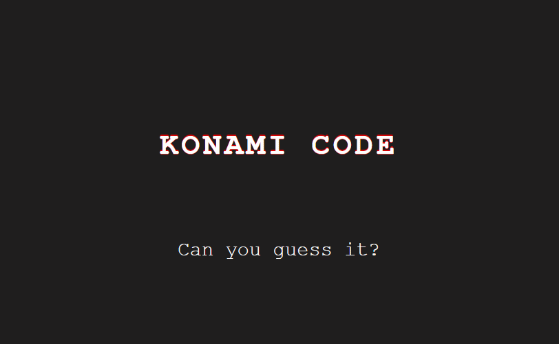

# [Wes Bos' 30 days Vanilla JS challenge](https://javascript30.com/)

## `No frameworks, no compilers, no fuss;`

### **[Day 12: KONAMI Code](https://2y2son4.github.io/konami-code)**.

#### **JS**

- [push()](https://developer.mozilla.org/en-US/docs/Web/JavaScript/Reference/Global_Objects/Array/push)
- [splice()](https://developer.mozilla.org/en-US/docs/Web/JavaScript/Reference/Global_Objects/Array/splice)
- [cornify_add()](https://github.com/Cornify/Cornify)

Click here to check the <strong>layout</strong>.

